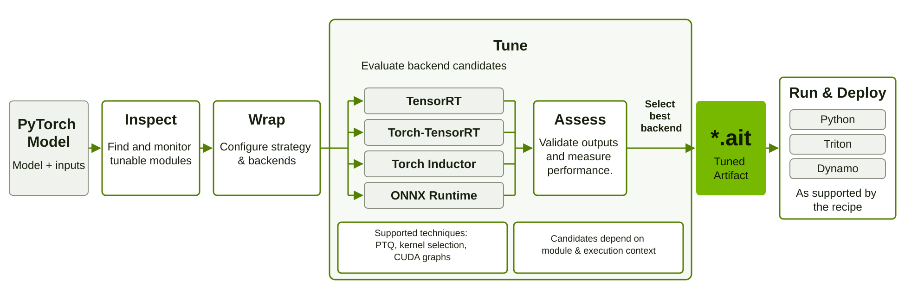

<!--
# SPDX-FileCopyrightText: Copyright (c) 2026 NVIDIA CORPORATION & AFFILIATES. All rights reserved.
# SPDX-License-Identifier: Apache-2.0
-->

# NVIDIA AITune

[](LICENSE)
[](https://www.python.org/downloads/)
[](https://pytorch.org/)

**NVIDIA AITune automates inference tuning for PyTorch models and pipelines on NVIDIA GPUs.**
It brings inference engines and acceleration techniques together under a single, extensible API. AITune combines
backend evaluation, numerical validation, and performance measurement into one workflow, selecting implementations
for individual modules according to the configured tuning strategy.

Start with a model from Hugging Face or timm, or bring your own model and checkpoint. For supported applications,
enable just-in-time tuning during inference, or use the explicit tuning API to prepare artifacts for deployment.

Find your model in the [recipe catalog](examples/README.md), or follow the
[quick start](https://docs.nvidia.com/aitune/learn/quick-start/).

## Why AITune?

- **Integrate through one API.** Use a shared workflow across supported backends. Extend the workflow with custom
  backends and tuning strategies.
- **Evaluate options per module.** Use default candidates that account for execution needs, or configure candidates
  explicitly. Different modules in a pipeline can use different backends.
- **Select using measurements.** Check numerical outputs and measure performance on representative inputs. Choose
  strategies for throughput, latency, or a latency budget to guide selection.
- **Prepare for deployment.** Reuse tuned modules in Python, generate Triton model repositories, or serve through
  Dynamo workers, as supported by the recipe.

## How it works

AITune combines these stages into a workflow for each model or pipeline:

1. **Inspect.** Provide a PyTorch model and representative inputs. AITune finds tunable `nn.Module` components
   and observes their inputs and execution.
2. **Wrap.** Customize the selected modules' tuning strategies and backend configurations.
3. **Tune.** Evaluate configured backend candidates, check numerical outputs against the original implementation,
   and measure performance on representative inputs. Select a backend using the configured strategy. Candidates can
   incorporate post-training quantization (PTQ), kernel selection, or CUDA graphs where supported by the backend.
4. **Run & deploy.** Run tuned modules in Python. Use the explicit workflow to save an `.ait` artifact for reuse
   or deployment with Triton or Dynamo, as supported by the recipe.

<a href="docs/assets/aitune_workflow.svg">
  
</a>

A shared tuning workflow brings supported backends and acceleration techniques together, with selection guided by
the configured strategy.

## Install

Use a Linux environment with an NVIDIA GPU and a compatible PyTorch and CUDA installation:

```bash
pip install --extra-index-url https://pypi.nvidia.com aitune
```

See the [installation guide](https://docs.nvidia.com/aitune/learn/install/) for requirements, containers, and
PyTorch/CUDA version selection.

## Quick start

Both examples use Stable Diffusion. Install the model dependencies:

```bash
pip install diffusers transformers
```

### Just-in-time (JIT): try acceleration in your existing application

Just-in-time tuning happens as your application runs, using inputs captured during inference.
Save this as `your_script.py`:

```python
import torch
from diffusers import DiffusionPipeline

pipe = DiffusionPipeline.from_pretrained(
    "stable-diffusion-v1-5/stable-diffusion-v1-5",
    torch_dtype=torch.float16,
).to("cuda")

image = pipe("A landscape with mountains and a lake").images[0]
image.save("landscape.png")
```

Enable AITune when launching the script:

```bash
AUTOWRAPT_BOOTSTRAP=aitune_enable_jit_tuning python your_script.py
```

The example saves an image to `landscape.png`. Use representative prompts for your workload.
Eligible modules use the selected implementations in the running application.
A new process starts tuning again; use the explicit workflow below for saved artifacts.
See the [JIT guide](https://docs.nvidia.com/aitune/guides/just-in-time-tuning/) for configuration and deferred tuning
for pipelines.

### Ahead-of-time (AOT): prepare a reusable tuning artifact

Ahead-of-time tuning prepares your model for deployment with a consistent flow:

<p align="center">
  <strong>inspect → wrap → tune → deploy</strong>
</p>

Provide your model and representative inputs:

```python
import torch
from diffusers import DiffusionPipeline

import aitune.torch as ait

pipe = DiffusionPipeline.from_pretrained(
    "stable-diffusion-v1-5/stable-diffusion-v1-5",
    torch_dtype=torch.float16,
).to("cuda")
inputs = [{"prompt": "A landscape with mountains and a lake"}]

modules = ait.inspect(pipe, inputs)
pipe = ait.wrap(pipe, modules.get_modules())
ait.tune(pipe, inputs)

image = pipe(**inputs[0]).images[0]
image.save("landscape.png")
ait.save(pipe, "tuned_pipe.ait")
```

This produces an image and a `tuned_pipe.ait` artifact that can be loaded into a compatible pipeline.
Use representative prompts or data for your workload. See the
[AOT guide](https://docs.nvidia.com/aitune/guides/ahead-of-time-tuning/) for tuning
configuration and the [checkpoint guide](https://docs.nvidia.com/aitune/guides/deployment/save-and-load-checkpoints/)
for saving and loading.

## Model recipes

Explore [ready-to-use model recipes](examples/README.md) for tuning, validation, benchmarking, and deployment.
Choose a model and a configuration for your GPU setup, precision, and deployment target, then adapt the recipe
with your own compatible checkpoint and data.

<!-- Add headline speedups here when measured recipe results are available. Link each claim to its workload,
     hardware, and comparisons against the Original Model. Document engineering effort with concrete integration
     tasks and reproducible setup steps; quantify time or cost savings only when supporting measurements exist. -->

## Learn more

- [Documentation](https://docs.nvidia.com/aitune/)
- [Supported backends](https://docs.nvidia.com/aitune/learn/backends/)
- [Multi-GPU tuning](https://docs.nvidia.com/aitune/guides/multi-gpu-integration/)
- [Profiling and hardware metrics](https://docs.nvidia.com/aitune/guides/advanced/profiling-and-hardware-metrics/)
- [Deployment overview](https://docs.nvidia.com/aitune/guides/deployment/overview/)
- [Triton deployment](https://docs.nvidia.com/aitune/guides/deployment/triton/)
- [Dynamo deployment](https://docs.nvidia.com/aitune/guides/deployment/dynamo/)

## Notice

**NOTICE AND DISCLAIMER: This software automatically retrieves, accesses or interacts with external materials. Those    retrieved materials are not distributed with this software and are governed solely by separate terms, conditions and licenses.  You are solely responsible for finding, reviewing and complying with all applicable terms, conditions, and licenses, and for verifying the security, integrity and suitability of any retrieved materials for your specific use case. This software is provided "AS IS", without warranty of any kind. The author makes no representations or warranties regarding any retrieved materials, and assumes no liability for any losses, damages, liabilities or legal consequences from your use or inability to use this software or any retrieved materials. Use this software and the retrieved materials at your own risk.**
