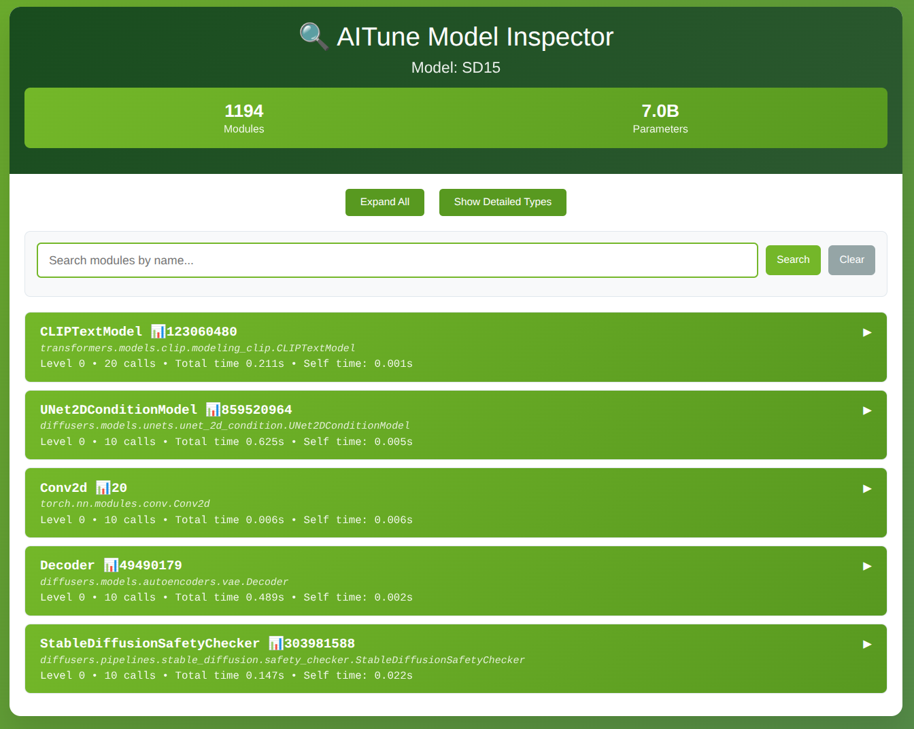
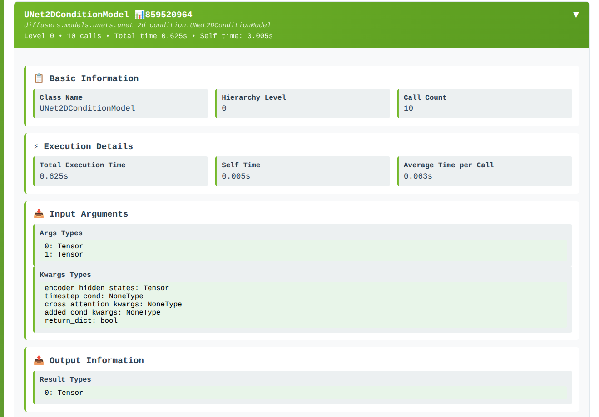

<!--
Copyright (c) 2025-2026, NVIDIA CORPORATION. All rights reserved.

Licensed under the Apache License, Version 2.0 (the "License");
you may not use this file except in compliance with the License.
You may obtain a copy of the License at

    http://www.apache.org/licenses/LICENSE-2.0

Unless required by applicable law or agreed to in writing, software
distributed under the License is distributed on an "AS IS" BASIS,
WITHOUT WARRANTIES OR CONDITIONS OF ANY KIND, either express or implied.
See the License for the specific language governing permissions and
limitations under the License.
-->

# Just-in-Time Inspect Guide

Just-in-time inspection captures module hierarchy and input/output signatures during real model execution, without tuning or compilation. Use it to understand what JIT tuning would see before you commit to a tuning strategy.

## Overview

Just-in-time inspection provides:

- **Module Discovery**: Capture modules that execute at runtime
- **Hierarchy View**: See parent/child relationships and depth
- **Input/Output Signatures**: Record tensor shapes, dtypes, and argument structure
- **HTML Report**: Generate a shareable inspection report

## Quick Start

### Enable inspection

Add a single import at the top of your script to enable inspection mode:

```python
import aitune.torch.jit.enable_inspection as inspection  # noqa: F401
```

### Run a real workload and save a report

The example below mirrors the Stable Diffusion inspection workflow used in
`tests/functional/pytorch/jit/006_jit_sd15_inspect.py`:

```python
import os
from logging import INFO, basicConfig
from pathlib import Path

import torch
from diffusers import StableDiffusionPipeline

import aitune.torch.jit.enable_inspection as inspection  # noqa: F401


def create_model():
    pipe = StableDiffusionPipeline.from_pretrained(
        "stable-diffusion-v1-5/stable-diffusion-v1-5", torch_dtype=torch.float16
    )
    pipe.to("cuda")
    return pipe


def main():
    basicConfig(level=INFO)
    prompt = (
        "A fluffy, orange tabby cat with bright green eyes is captured mid-air, "
        "pouncing playfully on a vibrant red ball of yarn"
    )
    pipe = create_model()

    def batch():
        with torch.no_grad():
            pipe([prompt] * 1, num_inference_steps=1)
            pipe([prompt] * 2, num_inference_steps=1)

    for _ in range(5):
        batch()

    html_path = "inspect_sd15.html"
    inspection.save_report(html_path, "SD15")


if __name__ == "__main__":
    main()
```

### Open the report

```bash
firefox output/inspect_sd15.html
# or
google-chrome output/inspect_sd15.html
```

## What the report shows

- **Module summary**: Total modules and basic statistics
- **Module hierarchy**: Tree view of the executed module structure
- **Module details**: Name, type, depth, parameter counts, call counts, execution times
- **Inputs/outputs**: Shapes, dtypes, and detected batch axes for each executed module

### Example screenshots

The main view gives a top-level summary of discovered modules and quick navigation across the report sections.



If you click on a particular module, the detailed view shows execution stats and its recorded input/output signatures.



## Notes

- Inspection data is collected only for modules that actually execute.
- Running multiple batches with different shapes helps capture dynamic behavior.
- The report is generated from in-memory inspection data at `save_report` time.

## Next Steps

- Learn about [Just-in-Time Tuning](jit_tuning.md) to actually tune models
- Compare with [AOT Inspect](aot_inspect.md) for more control
